# Концепты боссов — лонг-лист на отбор (ревизия 2 — под автобой)

Дата: 2026-09-10, **ревизия 2**. Статус: только концепты, код не менялся.

Первая ревизия этого дока была написана так, будто у игрока есть контроль над атаками: «придержи бурст», «не бей в щит», «уклонись от телеграфа», «отдыхает — бей безнаказанно». **Ничего из этого в игре сделать нельзя.** Бой автоматический; атаки идут по таймеру оружия и остановить их невозможно. Ревизия 2 переписана от того, что игрок действительно может нажать.

Опорные документы: `Docs/Design/2026-09-01-floor-boss-system-design.md`, `Docs/Design/2026-09-01-warden-implementation-report.md`.
Концепт-спрайты: `Assets/Art/Enemies/Bosses/Concepts/`.

---

## 0. Аудит: что игрок реально контролирует в бою

Проверено по коду, не по памяти.

**Полный список действий игрока во время боя** — это всё, что вызывается из UI (`RunFlowController.Combat.cs`):

| Действие | Код | Когда вообще имеет смысл |
|---|---|---|
| Выбрать цель | `CombatManager.SetPlayerTarget` ← клик по врагу (`RunFlowController.Combat.cs:631`) | только если врагов ≥2 |
| Нажать активный навык | `TryActivateSkill(slot)` ← клик по иконке / хоткей (`:725`, `:825`) | всегда, один слот на класс |
| Включить/выключить авто-каст навыка | `SetSkillAutoMode` (`:768`) | всегда |
| Бросить забег | `AbortCombat` из паузы (`RunFlowController.Pause.cs:30`) | это не тактика |

**Всё.** Нельзя: прекратить атаковать, уклониться по кнопке, заблокировать, выпить зелье, сменить снаряжение, отступить из боя.

**Активный навык у каждого класса ровно один, и они принципиально разные:**

| | Дженифер | Вайолет | Саша |
|---|---|---|---|
| Навык | «3 быстрые атаки», кд 4 с | «Дымовая граната», кд 5 с | «Берсерк», тумблер без кд |
| Что делает | 3 удара подряд + лок обычных атак на 11/12 с | Скрытность + N гарантированных критов | +20/30/40 % физ. сопротивления, **−1 % текущего HP в секунду** |
| Тип решения | **наступательное** | **защитное** (единственный аналог уклонения в игре) | **постоянный риск/награда** |

Из этой таблицы следует главное ограничение всей роспиcи:

> **У Дженифер нет реактивной кнопки.** Её единственный навык — атака. Любой босс, построенный на «ответь на телеграф, чтобы выжить», для неё непроходим *по построению*, потому что отвечать ей нечем.

Плюс важное про Сашу: `Rage = 1 + процент недостающего HP` (`CombatantRuntime.cs:293`), а «Берсерк» бьёт его же на 1 % текущего HP в секунду. То есть Саша **намеренно калечит себя, чтобы стать сильнее**. Любой босс, наказывающий низкий HP, конфликтует не со случайностью, а с ядром его класса — и это единственное место во всей игре, где такой босс создаёт настоящее решение («выключить Берсерк или дожать»).

### 0.1 Четыре рычага, которые в автобое вообще существуют

1. **Фильтр билда.** Босс задаёт вопрос снаряжению и навыкам, ответ на который дан ещё до входа в комнату. Броня против крита против уклонения против HP-пула против DoT. **Это основной и самый честный рычаг автобоя.** Игрок «отвечает» в кузнице и на левел-апе, а не в бою.
2. **Приоритет цели.** Работает только при нескольких врагах. Это единственное настоящее тактическое решение в реальном времени, которое есть в игре.
3. **Тайминг единственной кнопки.** Босс создаёт момент, когда нажать навык дороже, чем нажать его сразу. Работает, только если у всех трёх классов есть *какой-то* ответ (см. ограничение про Дженифер).
4. **Наказание авто-режима.** Босс, против которого авто-каст навыка объективно хуже ручного, — это законный дизайн: он вознаграждает внимание, ничего не требуя от рефлексов.

### 0.2 Таблица перевода: как сказать то, что хотелось, на языке автобоя

| Хотелось (не работает) | Как это выражается на самом деле |
|---|---|
| «Не бей, пока щит поднят» | **«Бей другого»** — только через второго врага на сцене, которого выгоднее бить. Без второй цели это не решение, а просто арифметика урона |
| «Придержи бурст» | **«Выключи авто-режим»** — единственная форма «придержать», доступная игроку |
| «Уклонись от телеграфа» | Только Вайолет («Дымовая граната»). Для Дженифер и Саши **не существует**. Телеграф может быть окном для урона, но не условием выживания |
| «Отдыхает — бей безнаказанно» | Игрок бьёт с той же скоростью в любом случае. Это темп боя, а не решение — так и надо это подавать |
| «Наказать за неправильное действие» | Нечего наказывать. Единственное «действие» игрока — нажатие навыка |
| «Не танцуй на низком HP» | Работает только для Саши (Берсерк). Для остальных двоих это спираль смерти без права голоса |

### 0.3 Что выброшено из ревизии 1 (и почему)

Конкретный список вырезанных механик, чтобы они не вернулись:

- **Рипост Пустого Дуэлянта** (урон растёт за каждый удар по неуязвимости) — игрок физически не может перестать бить. Это не проверка терпения, а штраф за существование. Босс вырезан целиком.
- **«Оседание» Каменного Идола** как «окно, когда бить не надо» — то же самое.
- **«Парад»/окна неуязвимости** как проверка терпения — везде переосмыслены в чистую арифметику темпа и честно так и названы.
- **«Отдых» Гончей после рывка** как «окно безнаказанного урона» — игрок бьёт одинаково всегда.
- **«Дай себя проржаветь — получишь больнее»** у Ржавого Кузнеца — игрок не выбирает, ржаветь ему или нет.
- **Смена правил боя** у Хора Проклятых — правила, на которые нельзя отреагировать, это не адаптация, а случайность. Босс вырезан.
- **Все формулировки «телеграф даёт время среагировать»** — реагировать нечем, кроме одной кнопки, и у Дженифер она атакующая.

Добавлено взамен два босса, придуманных сразу под автобой: **№8 Тюремщик** (единственный ответ — потратить навык до блокировки) и **№18 Свечник** (весь бой — чистый приоритет цели).

### 0.4 Правила честности

1. **Никакой магии как требования** — класса Mage нет, физический урон обязан работать против всех.
2. **Никакого требования очистки эффектов** — cleanse нет ни у кого, значит любой DoT конечен и с потолком стаков.
3. **Тяжёлый удар — в % от макс. HP цели, потолок 50 %.** Вайолет 15 HP базы против 45 у Саши; плоские числа убивают её и не замечаются им. Это причина большинства потенциальных непроходимостей.
4. **Броня никогда не обнуляется** (максимум −50 %) — иначе выключается Дженифер как класс.
5. **Лечение режется максимум на 50 %** — иначе выключается «Боевая регенерация» Саши.
6. **Ни один босс не строится на «ответь на телеграф, чтобы выжить»** — у Дженифер нет ответа (см. 0).
7. **Enrage-таймеры считаются по DPS Дженифер, а не Саши** — ориентир ~2× медианного времени убийства самым медленным классом.
8. **Опасная способность всегда телеграфируется ≥1.5 с** — не ради реакции, а ради читаемости: игрок должен понимать, *почему* у него отняли половину полоски.

---

## 1. Обзорная таблица

Колонка **«Решение игрока»** — самое важное: она честно говорит, есть ли в бою хоть одно живое решение, или это чистый фильтр билда. Чистый фильтр — это нормально и правильно, но их не должно быть 20 из 20.

| # | Босс | Этажи | Тип | Решение игрока в бою | Фазы | Цена в коде |
|---|---|---|---|---|---|---|
| — | Страж *(в игре)* | 1–3 | фильтр | нет | 2 | готово |
| 1 | Гончая Ямы | 1–3 | фильтр | нет (намеренно) | 1 | чистый контент |
| 2 | Каменный Идол | 1–4 | фильтр (броня) | нет | 2 | чистый контент |
| 3 | Матерь Спор | 2–4 | фильтр (DoT/HP) | нет | 2 | +1 `ApplyDot` |
| 4 | Ржавый Кузнец | 3–5 | фильтр (броня) | нет | 2 | +1 `StatDebuff` |
| 5 | Тени-Близнецы | 3–5 | **цель** | порядок убийства | по числу живых | мультиэнкаунтер |
| 6 | Пьяный Великан | 3–5 | **кнопка** | окно бурста / Берсерк off | 2 | чистый контент |
| 7 | Пожирающий Амальгам | 3–6 | **цель** | добивать куски или дожимать | по HP | спавн |
| 8 | **Тюремщик** *(новый)* | 4–6 | **кнопка** | потратить навык до блокировки | 2 | **готово** (`DisruptPlayerActiveSkills`) |
| 9 | Ледяная Плакальщица | 4–6 | фильтр (темп) | нет | 2 | +1 `ApplyFreeze` |
| 10 | Позолоченный Ростовщик | 4–6 | **авто-режим** | не сливать навык в щит | по щиту | +1 `ShieldRegen` |
| 11 | Часовой Титан | 5–8 | **кнопка** | навык под нужный шаг цикла | 3 (цикл) | циклический порядок |
| 12 | Мясник Глубин | 5–7 | **кнопка** (Саша) | выключить Берсерк | 2 | +1 `ExecuteBonus` |
| 13 | Паучиха-Прародительница | 5–7 | **цель** | чистить добавки или нет | 2 | спавн |
| 14 | Пожиратель Реликвий | 6–8 | фильтр (слоты) | нет | 3 | +1 `SlotDisable` |
| 15 | Зеркальный Двойник | 6–8 | фильтр (класс) | нет | 2 | ветвление по классу |
| 16 | Пепельный Инквизитор | 7–9 | фильтр (sustain) | нет | 2 | +2 `HealCut`,`Burn` |
| 17 | Костяной Левиафан | 7–9 | фильтр (выносливость) | нет | 2 | +1 `RoomTick` |
| 18 | **Свечник** *(новый)* | 7–9 | **цель** (чистый) | вся суть боя | по свечам | мультиэнкаунтер |
| 19 | **Владыка Ямы** | 10 финал | смешанный | окна бурста | 3 | сборка из готового |
| 20 | **Сердце Подземелья** | 10 альт-финал | **цель** | какую конечность бить | 3 | спавн + `RoomTick` |

Баланс роспиcи: 9 чистых фильтров билда, 5 боссов на приоритет цели, 5 на тайминг кнопки, 1 на авто-режим. Для автобоя это здоровое соотношение — большинство боёв читается как проверка сборки, а несколько дают живое решение.

---

## 2. Концепты

### 1. Гончая Ямы — фильтр билда

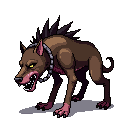 · этажи 1–3 · **решений в бою: нет, намеренно**

**Роль.** Второй вариант босса на первый этаж, чтобы старт забега перестал быть одинаковым. Страж — медленный и тяжёлый; Гончая — быстрая и лёгкая. Один и тот же билд чувствует их по-разному, и это вся её задача.

**Механики.** Очень быстрые слабые атаки (проверка брони: Дженифер их почти не замечает, Вайолет уклоняется, Саша терпит) + *Рывок* (Periodic, кд 7 с, телеграф 1.5 с) — HeavyAttack ×1.6 как единственный источник реальной угрозы.

**Фазы.** Одна. Самый простой босс роспиcи по построению.

**Честно о решениях.** Их нет. Игрок нажимает свой навык, когда тот готов, и это правильный ответ в 100 % случаев. Ценность босса — в вариативности первого этажа, а не в глубине.

**Класс-чек.** Проходится всеми легко — это и есть цель для босса первого этажа.

**Цена.** Ноль. `MonsterData` + `BossKitData` из двух `HeavyAttack`.

---

### 2. Каменный Идол — фильтр брони

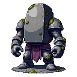 · этажи 1–4 · **решений в бою: нет**

**Роль.** Единственная причина, по которой игрок вообще заметит, что `ArmorPenetrationFlat` и `ArmorIgnorePercent` существуют. Босс-учитель: после него игрок начинает читать эти строчки на предметах.

**Механики.** Очень высокая броня, очень медленные атаки. Урон в него режется сильно, но не в ноль. Мимо брони бьют: кровотечение (Дженифер), яд (Вайолет), пробитие с предметов. *Обвал* (Periodic, кд 9 с, телеграф 2.5 с) — HeavyAttack ×2.0.

**Фазы.** 2. На 45 % HP по корпусу идёт трещина (смена спрайта): броня падает вдвое, скорость атаки удваивается. Медленный первый акт превращается в короткую драку — и это единственный момент, когда стоит держать навык наготове.

**Что вырезано из ревизии 1.** «Оседание» как окно, в которое не надо бить. Заменено ничем: босс честно работает как арифметический фильтр.

**Класс-чек.** У каждого класса есть свой обходной путь мимо брони, и ни одному он не обязателен — без него бой просто длиннее. Дженифер: кровотечение. Вайолет: яд + «Казнь». Саша: «Гроза великанов».

**Цена.** Ноль новых механик — только цифры в `MonsterData` и смена спрайта на фазе.

---

### 3. Матерь Спор — фильтр HP-пула и лечения

 · этажи 2–4 · **решений в бою: нет**

**Роль.** Учит, что «полоска HP почти не падает» ≠ «всё хорошо». Единственный ранний босс, чей урон идёт мимо брони и уклонения целиком.

**Механики.** *Споровое облако* (Periodic, кд 6 с, телеграф 1.5 с) — Poison, **потолок 5 стаков**, каждый истекает сам через 8 с (правило честности №2). Прямые атаки слабые и редкие. *Гниль* (Periodic, кд 15 с) — HealCut −40 % на 6 с.

**Фазы.** 2. На 50 % HP облако идёт чаще (кд 6 → 4 с), но потолок стаков не растёт — давление ровнее, а не бесконечнее.

**Класс-чек.** Дженифер: броня не помогает вообще → самый напряжённый ранний бой для неё, ответ — дожать быстро. Вайолет: уклонение снижает частоту новых стаков, но 15 HP делают потолок в 5 стаков обязательным. Саша: его регенерацию режет «Гниль», но −40 %, а не −100 %.

**Цена.** +1 `ApplyDot` (Poison уже написан, нужен только вызов от босса). `HealCut` общий с №16.

---

### 4. Ржавый Кузнец — фильтр «что у тебя есть, кроме брони»

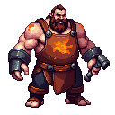 · этажи 3–5 · **решений в бою: нет**

**Роль.** Временно отбирает у игрока не HP, а цифры. Проверяет, держится ли билд на одном стате.

**Механики.** *Ржавчина* (Periodic, кд 10 с, телеграф 2 с) — −25 % брони игрока на 8 с, стакается до 2 (максимум −50 %, **никогда не в ноль** — правило честности №4). *Ковка* (Periodic, кд 14 с, телеграф 2.5 с) — HeavyAttack ×1.8, фиксированный множитель.

**Фазы.** 2. На 40 % HP «Ковка» получает −0.5 с телеграфа и кд 10 с.

**Что вырезано.** Условие «×2.2, если на тебе 2 стака Ржавчины». Игрок не решает, ржаветь ему или нет, — это был штраф без выбора, замаскированный под механику. Множитель стал фиксированным.

**Класс-чек.** Дженифер страдает больше всех (её выживание — броня) и у неё же есть «Я — стена»/«Несгибаемость» как пассивные страховки. Вайолет броню почти не использует → концепт её едва задевает, зато ×1.8 против 15 HP — задевает. Саша не замечает ни того, ни другого.

**Цена.** +1 `StatDebuff` (модификатор + таймер на существующее поле брони).

---

### 5. Тени-Близнецы — приоритет цели

 · этажи 3–5 · **решение: кого убивать первой и стоит ли**

**Роль.** Первый босс роспиcи с настоящим живым решением. Многовраговый цикл в `CombatManager` уже есть, оба близнеца ставятся на сцену при `StartCombat` — спавн не нужен.

**Механики.**
- Две сущности с раздельными HP-барами, ~40 % HP обычного босса каждая, бьют независимо и слабо.
- *Связь* — пока живы обе, каждая получает −30 % входящего урона.
- *Скорбь* — когда одна умирает, выжившая получает +50 % урона и +30 % скорости навсегда, с баннером и сменой спрайта.
- *Согласие* (Periodic, кд 12 с, телеграф 2 с, только пока живы обе) — одновременный удар, суммарно ×1.5.

**Настоящее решение.** Убить одну быстро (снять −30 %, но разбудить «Скорбь») или ровно снимать обеих (дольше, но без enrage). Оба варианта рабочие, и игрок реализует любой из них **кликом по врагу** — механизм, который в игре уже есть.

**Фазы.** По состоянию («живы обе» → «одна»), не по HP. Единственная такая ось в роспиcи.

**Класс-чек.** Главный риск — Вайолет: два независимых атакующих делают два броска на уклонение вместо одного, статистически ломая её защиту. Обязательная митигация: суммарный урон двоих равен урону одного обычного босса.

**Цена.** Мультиэнкаунтер: общий флаг босс-боя, победа = обе мертвы, триггер на смерть одной. Спавна нет — это вдвое дешевле №7/№13.

---

### 6. Пьяный Великан Ямы — окно бурста

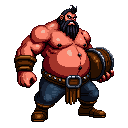 · этажи 3–5 · **решение: куда потратить навык**

**Роль.** Тональная разгрузка (вся остальная роспись мрачная) и самый чистый «оконный» босс: он периодически становится беззащитным, и это единственное место, где тайминг кнопки виден невооружённым глазом.

**Механики.**
- *Замах бочкой* (Periodic, кд 8 с, телеграф 3 с) — HeavyAttack ×2.5 (считать от макс. HP цели, правило №3).
- *Пошатнулся* (Periodic, кд 11 с) — теряет равновесие: бьёт **сам себя** на 8 % своего HP и получает **+50 % входящего урона на 3 с**, с явным баннером.
- *Отрыжка* (Periodic, кд 13 с, телеграф 1.5 с) — слабый урон + −20 % скорости атаки игрока на 3 с.

**Настоящее решение.** «Пошатнулся» — это окно, в которое навык стоит вдвое дороже. Работает для всех троих, но по-разному: Дженифер бьёт «3 быстрые атаки» в уязвимость (её кнопка атакующая — здесь это не недостаток), Вайолет копит гарантированные криты под окно, Саша **выключает Берсерк перед «Замахом»** и включает обратно в окно. Именно поэтому окно даёт бонус к получаемому урону, а не просто паузу: пауза не была бы решением.

**Фазы.** 2. На 35 % HP он трезвеет: «Пошатнулся» исчезает вместе с окном, телеграф «Замаха» сокращается до 2 с. Шутка кончилась — и вместе с ней кончились подарки.

**Класс-чек.** Самый ровный босс роспиcи. ×2.5 обязательно считать в процентах от макс. HP, иначе Вайолет ложится с одного удара.

**Цена.** Ноль, если «Пошатнулся» выразить как HeavyAttack по себе + `DamageTakenBuff`; последнее — крошечный флаг с таймером.

---

### 7. Пожирающий Амальгам — приоритет цели

 · этажи 3–6 · **решение: добивать куски или дожимать тушу**

**Роль.** Второй босс на приоритет цели, отличается от Близнецов тем, что цели появляются по ходу, а не стоят с начала. Даёт естественный повод для предметов с уроном по площади.

**Механики.**
- На 66 % и 33 % HP отделяет по слизню (~15 % HP босса, слабый, быстрый).
- *Поглощение* (Periodic, кд 15 с, телеграф 2 с) — если живой слизень есть, съедает его и **восстанавливает 10 % HP**.
- *Кислотный плевок* (Periodic, кд 7 с, телеграф 1.5 с) — HeavyAttack ×1.4 + Poison (потолок 2 стака).

**Настоящее решение.** Переключиться на слизня (не дать боссу отхилиться, но потерять урон по нему) или игнорировать и дожимать. Обе стратегии выигрывают при разных билдах — это признак хорошего решения, а не ложного выбора.

**Фазы.** Привязаны к порогам HP, то есть выражаются штатным механизмом.

**Класс-чек.** Вайолет добивает слизней быстрее всех. Саша просто дожимает быстрее, чем босс успевает есть. Дженифер — медленнее всех, ей выгоднее всех переключаться. Три разных валидных решения.

**Цена.** Спавн (`SpawnAdditionalEnemy` + очистка при смерти босса). Делится с №13 и №20.

---

### 8. Тюремщик *(новый, придуман под автобой)* — тайминг кнопки

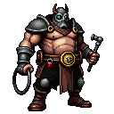 · этажи 4–6 · **решение: потратить навык до блокировки**

**Роль.** Единственный босс роспиcи, который целится не в HP игрока, а в его *единственный рычаг*. И — редкий случай — он **уже реализуем без единой новой механики**: `CombatManager.DisruptPlayerActiveSkills(seconds)` написан и работает, включая корректную обработку тумблера Саши (гасит и восстанавливает после снятия).

**Механики.**
- *Кандалы* (Periodic, кд 18 с, телеграф **3 с**, баннер «тянется к твоим цепям») — по истечении телеграфа `DisruptPlayerActiveSkills(8f)`: активный навык заблокирован на 8 с.
- *Дубинка* (Periodic, кд 9 с, телеграф 1.5 с) — HeavyAttack ×1.7.
- Обычные атаки средние и ровные.

**Настоящее решение.** Три секунды телеграфа — это ровно окно, чтобы **потратить навык до того, как его отнимут**. Решение есть у всех троих и у каждого своё: Дженифер сливает «3 быстрые атаки» (иначе кулдаун просто прогорит впустую), Вайолет ставит «Дымовую гранату» так, чтобы Скрытность перекрыла блокировку, Саша перед «Кандалами» решает, стоит ли вообще держать Берсерк включённым, зная, что его принудительно погасят.

Это же делает босса **прямым наказанием авто-режима**: авто-каст сработает как попало и с высокой вероятностью прогорит в блокировку.

**Фазы.** 2. На 45 % HP кд «Кандалов» падает до 12 с, а длительность блокировки — до 6 с: чаще, но короче. Ритм остаётся играбельным, давление растёт.

**Класс-чек.** Идеально ровный: каждый класс теряет свой единственный навык, но у каждого своя цена потери. Обязательное ограничение: блокировка **никогда не длиннее 8 с** и всегда с 3-секундным телеграфом — иначе это ощущается как отобранный геймплей, а не как задача.

**Цена.** **Ноль нового кода** — метод существует. Нужен только `BossAbilityEffectKind.DisruptSkills`, дёргающий его: один `case` в `ExecuteBossAbility`. Лучшая отдача на вложенный труд во всей роспиcи.

---

### 9. Ледяная Плакальщица — фильтр темпа

 · этажи 4–6 · **решений в бою: нет**

**Роль.** Единственная, кто использует существующую систему Freeze со стороны врага. Заморозка отнимает у игрока время атак — то есть работает как замедление гонки, а не как проверка реакции. В автобое это честно.

**Механики.** Быстрые слабые атаки. *Плач* (Periodic, кд 11 с, телеграф 2.5 с) — накладывает Freeze; существующие `FreezeImmune`/`FreezeImmuneTimer` системно исключают цепочки заморозок. *Иней* (Periodic, кд 8 с) — −20 % скорости атаки на 5 с, не стакается.

**Фазы.** 2. На 50 % HP скорость растёт, «Плач» уходит на кд 8 с, спрайт становится яростнее.

**Честно о слабости концепта.** Заморозка бьёт по всем классам одинаково — босс мало различает сборки, то есть как фильтр он слабый. Его ценность чисто экономическая: это самый дешёвый способ получить «страшную» механику, потому что Freeze уже написан и уже защищён от цепочек.

**Цена.** +1 `ApplyFreeze` — по сути один вызов существующей системы.

---

### 10. Позолоченный Ростовщик — наказание авто-режима

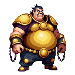 · этажи 4–6 · **решение: не сливать навык в щит**

**Роль.** Фильтр на *стабильность* урона (щит регенерирует — билд с редкими слабыми ударами его не пробьёт) плюс единственный босс, где авто-режим объективно хуже ручного.

**Механики.**
- *Монетный панцирь* (OnCombatStart) — ShieldPool ~35 % HP босса, **регенерирует 3 %/с**, если по нему не били 2 с. Реген деградирует на 20 % каждые 20 с боя (страховка от непроходимости).
- *Обесценивание* (Periodic, кд 12 с, телеграф 2 с) — HeavyAttack ×1.7 + крадёт немного золота забега.
- *Жадность* — пока щит цел, босс бьёт на +30 %; после пробития −30 % урона на 5 с.

**Настоящее решение.** Навык, потраченный в полный щит, почти полностью съедается. Тот же навык после пробития щита идёт в HP. Игрок реализует это ровно одним способом — **выключив авто-каст и нажимая руками**. Это единственная форма «придержать бурст», которая в игре существует, и здесь она даёт измеримую выгоду.

**Фазы.** По состоянию щита («цел» ↔ «пробит»), не по HP. Единственный немонотонный переход в роспиcи — потребует чуть больше, чем штатный `TryEnterNextPhase`.

**Класс-чек.** Саша с ровным потоком урона пробивает щит стабильно. Вайолет сносит его бурстом. Дженифер — самая медленная, реген щита мешает ей сильнее всех; деградация регена обязательна именно ради неё.

**Цена.** +1 `ShieldRegen` + расширение фазовой машины на не-HP-условие.

---

### 11. Часовой Титан — тайминг кнопки, лучший кандидат роспиcи

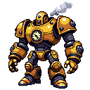 · этажи 5–8 · **решение: под какой шаг цикла подвести навык**

**Роль.** Единственный босс, которого второй раз проходишь заметно лучше, потому что выучил. В автобое, где игрок почти всё решает до боя, это редкость — и именно поэтому он главный кандидат «босса, которого полюбят».

**Механики.** Жёсткий, всегда одинаковый цикл; текущий шаг показывает стрелка на циферблате в груди (читается без текста):
1. *Первая шестерня* — три быстрых слабых удара.
2. *Вторая шестерня* — ShieldPool на 4 с (урон почти не проходит).
3. *Третья шестерня* — HeavyAttack ×2.2, телеграф 2 с; **на время замаха титан получает +40 % входящего урона** (открытая грудь).

**Настоящее решение.** Кулдаун навыка (4–5 с) и период цикла подобраны так, что «нажимать сразу как готов» рассинхронизируется с шагом 3. Чтобы попадать в открытую грудь, надо иногда **придержать нажатие на секунду** — то есть играть руками. Это работает для всех трёх классов, потому что окно даёт бонус к урону, а не требует защиты (правило честности №6).

**Фазы.** 3, но не по HP: фаза = позиция в цикле. Визуальный индикатор — стрелка на циферблате.

**Класс-чек.** Абсолютно детерминирован, поэтому честен ко всем. Саша копит ярость на шаге 2, Вайолет заряжает криты к шагу 3, Дженифер сливает серию в открытую грудь.

**Цена.** Ноль новых эффектов, но нужен **циклический порядок** способностей вместо независимых кулдаунов — маленькая правка `BossEncounterState` (индекс вместо словаря таймеров), полезная и всем остальным.

---

### 12. Мясник Глубин — единственное решение, адресованное Саше

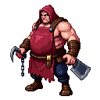 · этажи 5–7 · **решение: выключить Берсерк или дожимать**

**Роль.** Единственный босс, который напрямую спорит с ядром класса Саши. `Rage = 1 + недостающее HP`, а «Берсерк» ежесекундно калечит его сам — то есть Саша по дизайну хочет быть на низком HP. Мясник делает низкий HP смертельным. Это настоящий конфликт, а не случайность.

**Механики.**
- *Крюк* (Periodic, кд 9 с, телеграф 2 с) — HeavyAttack ×1.5, множитель линейно растёт до ×2.5 по мере падения HP игрока ниже 40 %.
- *Разделка* (Periodic, кд 7 с) — Bleed, потолок 3 стака, истекают сами.
- Обычные атаки сильные и медленные.

**Настоящее решение** — только у Саши, и это надо признать прямо: выключить Берсерк (потерять Ярость, урон и сопротивление, но сбить рост «Крюка») или дожать. Для Дженифер и Вайолет это чистый фильтр на HP-пул.

**Фазы.** 2. На 50 % HP мясник входит в раж: +40 % скорости, но «Крюк» пропадает — давление меняет форму, а не просто растёт.

**Риск.** Спираль смерти: чем хуже дела, тем больнее бьёт. Для Дженифер и Вайолет это бой без права голоса. Митигация: множитель растёт только до ×2.5 и только ниже 40 % HP, и обязательно считается от макс. HP цели.

**Цена.** +1 `ExecuteBonus` (зеркало существующего игрокового `Execution`). Bleed уже есть.

---

### 13. Паучиха-Прародительница — приоритет цели под давлением

 · этажи 5–7 · **решение: чистить добавки или игнорировать**

**Роль.** Классический босс с добавками; отличается от Амальгама тем, что добавки идут волнами по таймеру, а не по порогам HP, — давление ритмичное, а не ступенчатое.

**Механики.**
- *Кладка* (Periodic, кд 14 с, телеграф 2 с) — 2 паучонка (мало HP, слабый урон, быстрые). **Жёсткий потолок: одновременно живых не больше 3.**
- *Кокон* — пока жив хоть один паучонок, паучиха получает −25 % входящего урона.
- *Ядовитый укус* (Periodic, кд 10 с, телеграф 1.5 с) — HeavyAttack ×1.6 + Poison (потолок 3 стака).

**Настоящее решение.** Снять −25 % (потратив время на мелочь) или бить сквозь него. В отличие от Амальгама здесь у игнорирования есть накапливающаяся цена — паучата не исчезают сами.

**Фазы.** 2. На 40 % HP «Кладка» уходит на кд 9 с, но спавнит по одному.

**Класс-чек.** Потолок в 3 паучонка — **обязательное условие проходимости Вайолет**: каждый добавочный атакующий это лишний бросок против её уклонения. Саша игнорирует мелочь, Дженифер съедает её бронёй.

**Цена.** Спавн, общий с №7 и №20.

---

### 14. Пожиратель Реликвий — фильтр «не держись за один предмет»

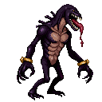 · этажи 6–8 · **решений в бою: нет**

**Роль.** На время выключает один слот снаряжения. Проверяет, держится ли билд на единственном предмете, и даёт лучшую в роспиcи историю («он сожрал мой шлем»).

**Механики.**
- *Заглатывание* (Periodic, кд 20 с, телеграф 3 с, баннер называет слот) — слот отключается на 10 с. Порядок фиксированный: Helmet → Boots → Ring → Accessory. **Оружие и броня не входят в пул никогда** — иначе Дженифер без брони и Вайолет без оружия просто ложатся. Если слот пуст, берётся следующий занятый.
- Пока слот отключён, пожиратель получает +20 % входящего урона («занят перевариванием») — компенсация игроку.
- *Отрыжка* (Periodic, кд 8 с, телеграф 1.5 с) — HeavyAttack ×1.6.

**Фазы.** 3 (70 %, 35 %): длительность отключения 10 → 13 → 16 с, бонус к получаемому урону 20 → 30 → 40 %.

**Честно.** Решений в бою нет — окно +20 % совпадает с блокировкой слота автоматически, игрок его не выбирает. Это чистый фильтр с хорошей подачей.

**Цена.** +1 `SlotDisable`, но он трогает пересчёт статов из экипировки — самая «грязная» правка списка, дороже, чем выглядит.

---

### 15. Зеркальный Двойник — фильтр, который знает твой класс

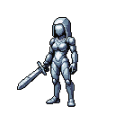 · этажи 6–8 · **решений в бою: нет**

**Роль.** Три разных боя из одного ассета: двойник копирует класс игрока. Лучшая отдача на единицу работы во всей роспиcи и единственный способ показать игроку его собственный класс со стороны.

**Механики.** Набор способностей выбирается по `CharacterClass` при создании боя:
- *Против Дженифер* — высокая броня и Thorns-отражение: оборона против обороны, затяжной бой.
- *Против Вайолет* — уклонение и яд: её атаки часто мажут, нужен объём, а не только пик.
- *Против Саши* — двойник копит собственную «ярость» и разгоняется: гонка на выносливость против его же механики.
- *Отражение* (Periodic, кд 12 с, телеграф 2 с) — HeavyAttack ×1.8, общий для всех веток.

**Фазы.** 2. На 50 % HP зеркало трескается: копия классa спадает, остаётся обычный, но более быстрый набор.

**Класс-чек.** Он *и есть* класс-чек, поэтому честен по построению. Обратный риск: против класса, который игрок знает наизусть, двойник может оказаться слишком лёгким. Митигация — ~120 % статов игрока.

**Цена.** Не новый эффект, а новая точка ветвления в `CombatantFactory` (чтение класса игрока и выбор кита). Средняя стоимость, высокая отдача.

---

### 16. Пепельный Инквизитор — фильтр sustain-билдов

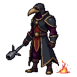 · этажи 7–9 · **решений в бою: нет**

**Роль.** К 7–9 этажу игрок обвешан регенерацией и вампиризмом. Инквизитор — единственный, кто спрашивает «а если лечение работает вполовину?».

**Механики.**
- *Приговор* (OnCombatStart, на весь бой) — HealCut −50 % (жёсткий потолок, правило №5).
- *Клеймо* (Periodic, кд 10 с, телеграф 2 с) — Burn: тикает чаще и слабее, чем Poison, потолок 4 стака, каждый истекает за 6 с.
- *Аутодафе* (Periodic, кд 16 с, телеграф 3 с) — HeavyAttack ×2.0 + 0.15 за каждый активный стак Клейма.

**Фазы.** 2. На 40 % HP босс получает +25 % урона, но телеграф «Аутодафе» удлиняется до 3.5 с — опаснее и одновременно читаемее.

**Класс-чек.** Саша — прямая цель концепта (режется его регенерация), но −50 %, а не −100 %, и его HP-пул сам по себе ответ. Дженифер от лечения не зависит вовсе. Вайолет: потолок 4 стака Burn обязателен против её 15 HP.

**Цена.** +2: `HealCut` (общий с №3) и `Burn` (ещё один DoT поверх существующего механизма). Дешевле, чем кажется, если №3 уже сделан.

---

### 17. Костяной Левиафан — фильтр выносливости

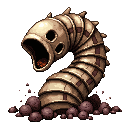 · этажи 7–9 · **решений в бою: нет**

**Роль.** Единственный бой на выносливость: огромный HP-пул и фоновый урон по всей комнате. Контраст к бурст-боссам и естественное место для встроенного таймера.

**Механики.**
- HP примерно вдвое выше обычного босса этажа, урон за удар ниже среднего.
- *Осыпь* (RoomTick, каждые 3 с) — небольшой урон **в % от макс. HP цели**, нельзя уклониться, частично режется бронёй. Чем дольше бой, тем дороже.
- *Захлёст* (Periodic, кд 12 с, телеграф 2.5 с) — HeavyAttack ×1.9.
- *Погружение* (Periodic, кд 20 с) — уходит под пол на 3 с: неуязвим и не атакует. Честная пауза в ритме, не решение.

**Фазы.** 2. На 35 % HP «Осыпь» ускоряется до каждые 2 с — встроенный enrage без отдельной системы.

**Класс-чек.** Самое опасное место роспиcи для Вайолет: неуклоняемый постоянный урон обходит её единственную защиту при худшем HP-пуле. **Процентная «Осыпь» — обязательное условие**, без него бой ей непроходим. Саша — король этого боя, Дженифер режет «Осыпь» бронёй.

**Цена.** +1 `RoomTick`. Простой, но требует аккуратности с боевым логом, чтобы не спамить.

---

### 18. Свечник *(новый, придуман под автобой)* — чистый приоритет цели

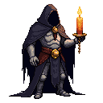 · этажи 7–9 · **решение: весь бой состоит из него**

**Роль.** Замена вырезанному Хору Проклятых. Хор менял правила, на которые нельзя отреагировать; Свечник берёт ту же идею «босс, который заставляет думать» и переводит её на единственный язык, который автобой понимает — **выбор цели**.

**Механики.**
- Свечник **неуязвим, пока горит хотя бы одна Свеча**. Свеча — отдельная сущность на сцене: мало HP, не атакует, но пока горит, даёт Свечнику неуязвимость.
- Свечей три, они зажигаются по очереди. *Зажечь* (Periodic, кд 12 с, телеграф 2 с) — Свечник заново зажигает одну потушенную свечу.
- То есть окно урона по боссу = промежуток между «потушил последнюю» и «зажёг новую».
- *Воск* (Periodic, кд 8 с, телеграф 1.5 с) — HeavyAttack ×1.8 по игроку. Свечник опасен всё время, включая свою неуязвимость.

**Настоящее решение.** Это ровно та ситуация, ради которой в разделе 0.2 написано «не бей → бей другого»: пока свечи горят, весь урон в босса пропадает впустую, и единственный правильный ответ — **переключить цель кликом**. Автоцель (если она бьёт босса) здесь проигрывает подчистую. Босс, который учит игрока пользоваться выбором цели вообще.

**Фазы.** По числу горящих свечей. На последней фазе (все три потушены разом) Свечник впадает в отчаяние: +50 % скорости, но зажигать больше нечего.

**Класс-чек.** Ровный для всех: свечи умирают от любого урона, важен только клик. Вайолет тушит их быстрее, Дженифер стабильнее, Саша просто мощнее — темп разный, решение одинаковое. Обязательное ограничение: Свечи **не атакуют**, иначе Вайолет получает лишние броски против уклонения.

**Цена.** Мультиэнкаунтер (общий с №5) + флаг неуязвимости, привязанный к живым сущностям. Спавн не нужен, если все три свечи стоят с начала и «зажигаются» = воскрешаются на месте.

---

### 19. Владыка Ямы *(кандидат в финалы, 10 этаж)*

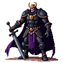 · **решение: окна бурста в каждой фазе**

**Роль.** Финал как экзамен по всему пройденному, собранный **целиком из уже сделанного** — это его главное достоинство.

**Механики по фазам.**
- **Фаза 1 (100–65 %) «Суд»** — медленные тяжёлые удары (телеграф 2.5 с, ×2.0) + ShieldPool на старте. Страж, только злее.
- **Фаза 2 (65–30 %) «Казнь»** — щит спадает, +60 % скорости, добавляется `ExecuteBonus` (как у Мясника).
- **Фаза 3 (30–0 %) «Последний Аргумент»** — Enrage-рамп (+8 % урона каждые 8 с), телеграф тяжёлого удара сокращается до 1.2 с. Гонка, где игрок обязан дожать.
- В каждой фазе есть одно окно: после каждого тяжёлого удара Владыка открывается на 2 с (+35 % входящего урона). Это то, подо что подводится навык.

**Класс-чек.** Три фазы проверяют три разные вещи, так что ни один класс не проходит всё своей сильной стороной: Дженифер сильна в фазе 1, Вайолет в фазе 2, Саша в фазе 3.

**Цена.** Ноль нового, **если** до него сделаны `ExecuteBonus` (№12), `Enrage` и `DamageTakenBuff` (№6). Аргумент делать финал последним и бесплатно.

---

### 20. Сердце Подземелья *(альтернативный финал, 10 этаж)*

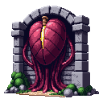 · **решение: какую конечность бить**

**Роль.** Другой ответ на вопрос «что такое финал»: не сильнейший воин, а само подземелье, чьими органами были все прошлые боссы. Держать как альтернативу №19, а не вместе с ним — два финала дают реиграбельность.

**Механики.**
- Сердце **не атакует само** и имеет очень много HP.
- *Биение* (RoomTick, каждые 4 с) — урон по комнате **в % от макс. HP**, растёт на 10 % за каждое биение. Бой физически не может длиться вечно.
- *Призыв органов* (Periodic, кд 18 с, телеграф 3 с) — спавнит «конечность»: ослабленную копию одного из боссов, побеждённых игроком **в этом забеге**. Убийство конечности замедляет «Биение» на 15 %.
- *Свод* (Periodic, кд 25 с) — ShieldPool, спадает только от урона.

**Настоящее решение.** Бить сердце (быстрее финиш, но биение разгоняется) или чистить конечности (сбить таймер ценой времени). Это тот же выбор, что у Амальгама, но с нарастающей ставкой.

**Класс-чек.** «Биение» — обязательно в % от макс. HP, иначе Вайолет вылетает. Спавн копий уже побеждённых боссов автоматически даёт каждому классу знакомые угрозы.

**Цена.** Дорого: спавн (общий с №7/№13), `RoomTick` (общий с №17) и **новое** — история побеждённых боссов забега как источник спавна.

---

## 3. Что вырезано целиком

**Пустой Дуэлянт** (был №8). Вся его суть — «рипост тем сильнее, чем больше ты бил в его неуязвимость». Игрок не может прекратить бить, значит это был не выбор, а гарантированный штраф. Без рипоста остаётся «быстрый босс с окнами неуязвимости», что дублирует роль Ледяной Плакальщицы. Слот отдан **Тюремщику**.

**Хор Проклятых** (был №18). Смена правил боя каждые 20 секунд предполагает, что игрок адаптирует поведение. Поведения у него нет — есть одна кнопка. Правила, на которые нельзя отреагировать, это не адаптация, а случайный множитель к сложности. Единственная рабочая часть (убить певчего → снять правило) — это приоритет цели, который дешевле и чище выражен в **Свечнике**, занявшем его слот.

Спрайты обоих остались в `Concepts/` (`Boss_HollowDuelist.png`, `Boss_CorruptedChoir.png`) — если захочется вернуть образы под другую механику, арт уже есть.

---

## 4. Рекомендации по отбору

**Волна 1 — почти бесплатно, сразу даёт вариативность этажей 1–5:**
№1 Гончая Ямы, №2 Каменный Идол (оба — чистый контент, ноль кода), №6 Пьяный Великан. Это делает «несколько боссов на этаж» реальностью на текущей кодовой базе.

**Волна 2 — лучшая отдача на труд, здесь появляются живые решения:**
№8 **Тюремщик** (один `case`, метод уже написан — брать первым), №11 **Часовой Титан** (маленькая правка `BossEncounterState` на циклический порядок), №5 Тени-Близнецы (мультиэнкаунтер — инвестиция, которая потом откроет №18).

**Волна 3 — фильтры билда для средних и поздних этажей:**
№3 Матерь Спор, №4 Ржавый Кузнец, №12 Мясник Глубин, №16 Пепельный Инквизитор, №17 Костяной Левиафан. После них №19 Владыка Ямы собирается финалом бесплатно.

**Волна 4 — по одной инфраструктурной инвестиции каждая:**
Спавн миньонов → №7 Амальгам и №13 Паучиха разом. Ветвление по классу → №15 Зеркальный Двойник.

**Держать на потом:** №14 Пожиратель Реликвий (трогает пересчёт экипировки), №20 Сердце Подземелья (только если №19 уже есть).

**Если брать только три босса** — №8 Тюремщик, №11 Часовой Титан, №5 Тени-Близнецы. Это три *разных* решения игрока (кнопка под давлением, кнопка в ритме, выбор цели) и вместе они добавляют в автобой ровно ту глубину, которой у него сейчас нет вообще.
